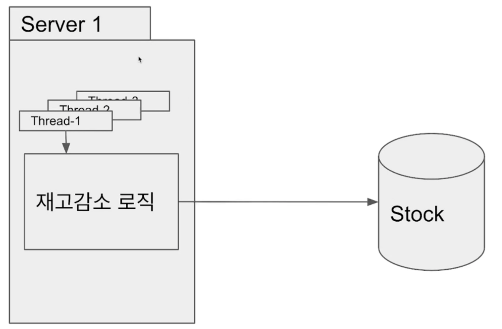
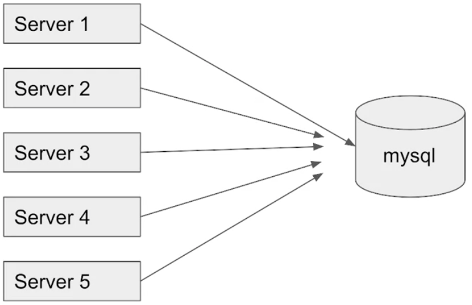
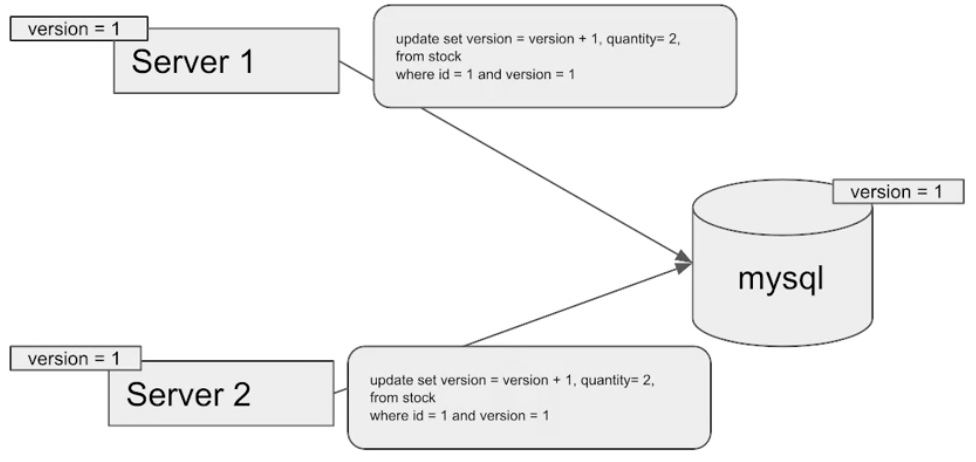
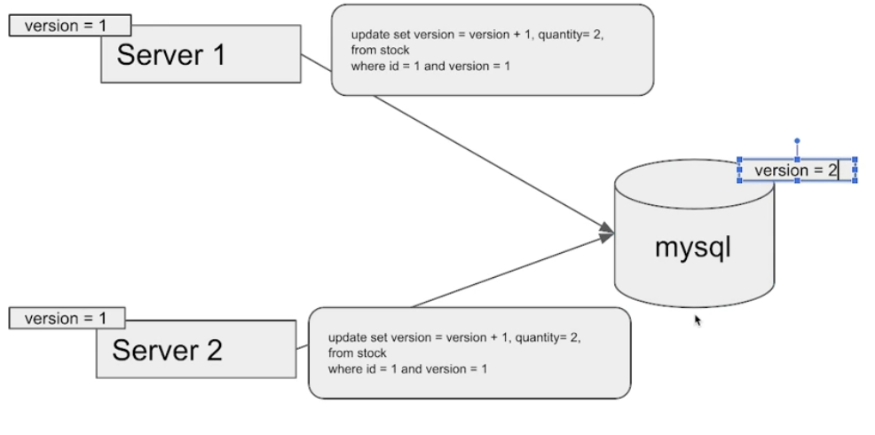
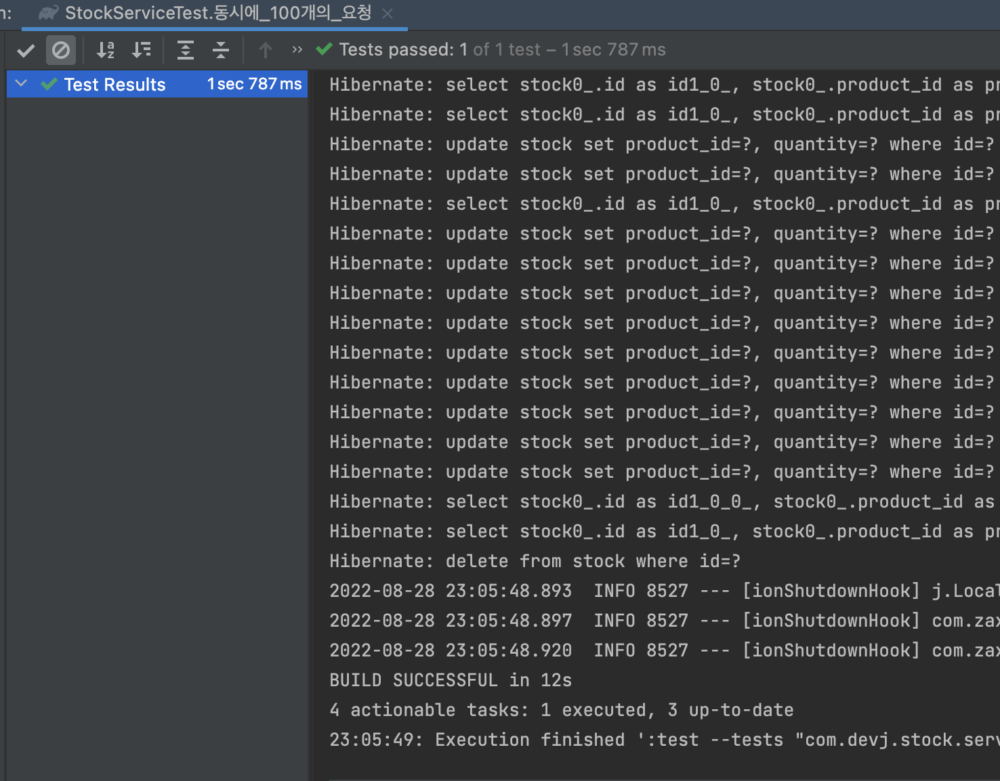
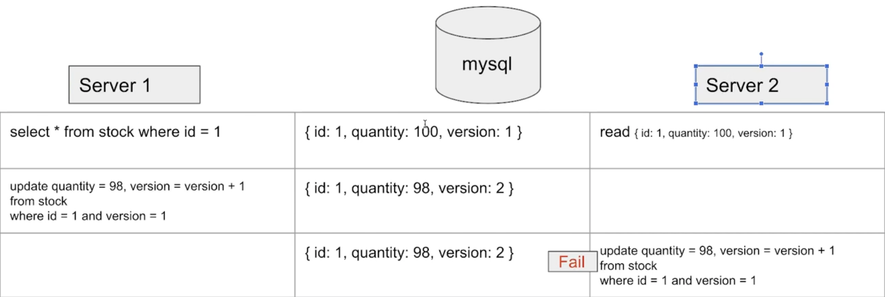
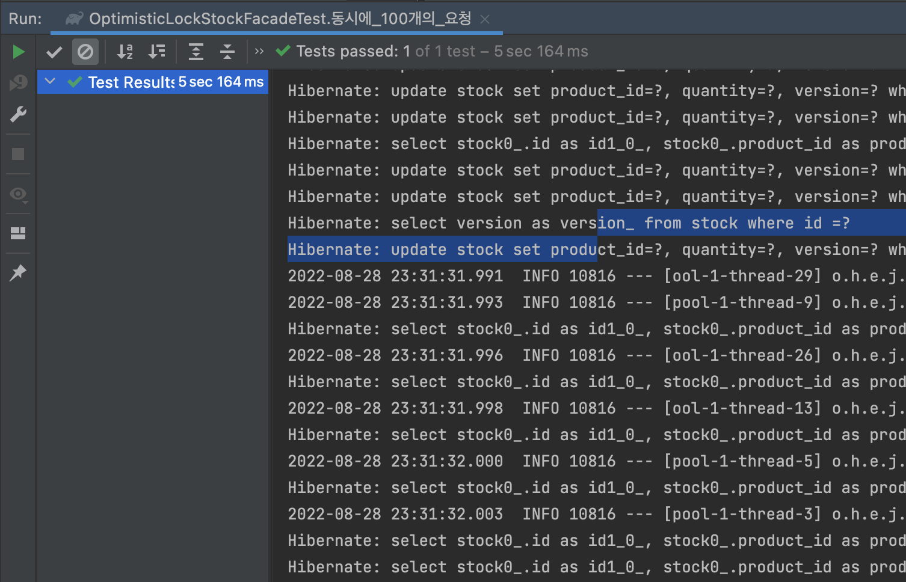

- [프로젝트 환경](#프로젝트-환경)
- [재고시스템 만들어보기](#재고시스템-만들어보기)
	- [현재와 같은 상황에서 동시성 문제점](#현재와-같은-상황에서-동시성-문제점)
	- [Race Condition](#race-condition)
- [Synchronized 사용하기](#synchronized-사용하기)
	- [Synchronized 문제점](#synchronized-문제점)
- [Database 사용하기 - MySQL](#database-사용하기---mysql)
	- [Pessimistic Lock 활용해보기](#pessimistic-lock-활용해보기)
	- [Optimistic Lock 활용해보기](#optimistic-lock-활용해보기)
	- [Named Lock 활용해보기](#named-lock-활용해보기)
- [Redis 사용하기](#redis-사용하기)
- [마무리 - MySQL과 Redis 비교](#마무리---mysql과-redis-비교)

## 프로젝트 환경

## 재고시스템 만들어보기

</br>

> 간단한 재고 entity를 만든 후 내부 재고를 감소시키는 내부 비즈니스 로직을 담는 decrease 메서드를 작성한다.  
> 이후 일반적으로 테스트를 작성하면 별 문제 없이 통과되는 경우를 확인할 수 있다.

</br>

```java
@Entity
public class Stock {

	@Id
	@GeneratedValue(strategy = GenerationType.IDENTITY)
	private Long id;

	private Long productId;

	private Long quantity;

	protected Stock(){}

	public Stock(Long productId, Long quantity) {
		this.productId = productId;
		this.quantity = quantity;
	}

	public Long getQuantity() {
		return quantity;
	}

	public void decrease(Long quantity){
		Assert.isTrue(this.quantity >= quantity, "재고가 부족합니다.");
		this.quantity -= quantity;
	}
}
```

```java
@Service
@Transactional
public class StockService {

	private final StockRepository stockRepository;

	public StockService(StockRepository stockRepository) {
		this.stockRepository = stockRepository;
	}

	public void decrease(Long id, Long quantity){
		//get stock
		Stock stock = stockRepository.findById(id).orElseThrow();

		//재고 감소
		stock.decrease(quantity);
	}
}

```

```java
@SpringBootTest
class StockServiceTest {

	@Autowired
	private StockService stockService;

	@Autowired
	private StockRepository stockRepository;

	@BeforeEach
	void setup(){
		Stock stock = new Stock(1L, 100L);
		stockRepository.saveAndFlush(stock);
	}

	@AfterEach
	void teardown(){
		stockRepository.deleteAll();
	}

	@Test
	public void 재고감소_확인(){
		stockService.decrease(1L, 99L);

		// 100 - 1 = 99

		Stock stock = stockRepository.findById(1L).orElseThrow();

		assertThat(stock.getQuantity()).isEqualTo(99L);
	}
}
```

|                테스트 결과 확인                 |
| :---------------------------------------------: |
|  |

</br>

### 현재와 같은 상황에서 동시성 문제점

</br>

> 만약 해당 api의 요청이 동시에 몰리게 될 경우,  
> 해당 사용자에게 정확한 재고 수량을 보장해줄 수 있는가?

</br>

- 100개의 스레드로 동시에 id가 1인 stock의 재고를 1씩 감소시켰다.
- 예상과 다르게 남의 재고의 개수가 0과 같지 않을 경우 테스트가 성공해야한다.

```java
	@Test
	public void 동시에_100개의_요청() throws InterruptedException {
		int threadCount = 100;
		ExecutorService executorService = Executors.newFixedThreadPool(32);
		CountDownLatch latch = new CountDownLatch(threadCount); // 다른 스레드에서 수행중인 작업이 완료될때까지 대기할 수 있도록 도와주는 클래스

		for (int i = 0 ; i < threadCount; i++){
			executorService.submit(
				() -> {
					try {
						stockService.decrease(1L, 1L);
					}
					finally {
						latch.countDown();
					}
				});
		}
		latch.await();

		Stock stock = stockRepository.findById(1L).orElseThrow();
		assertThat(stock.getQuantity()).isNotEqualTo(0L);
	}
```

</br>

|                                          재고의 개수가 0이 아닌 테스트 성공                                           |
| :-------------------------------------------------------------------------------------------------------------------: |
|  |

</br>

- 우리가 기존에 작성했던 방식은 단일 스레드에서만 값이 보장하는 상황이다.
- 현재 멀티스레드를 돌려 동시에 요청이 들어갈 경우 동시성 이슈가 발생한다.
  - `race condition 발생`

</br>

### Race Condition

</br>

|                   Thread - 1                    |        Stock        |                   Thread - 2                    |
| :---------------------------------------------: | :-----------------: | :---------------------------------------------: |
|        select \* from stock where id = 1        | {id: 1, quantity:5} |                                                 |
|                                                 | {id: 1, quantity:5} |        select \* from stock where id = 1        |
| update set quantity = 4 from stock where id = 1 | {id: 1, quantity:4} |                                                 |
|                                                 | {id: 1, quantity:4} | update set quantity = 4 from stock where id = 1 |

</br>

- 수업 내용

> 예를 들어 Thread1에서 stock을 조회하고 업데이트하기 직전에, thread2가 조회를 할 경우  
> 서로 같은 데이터를 조회한 후 같은 quantity를 4로 업데이트하기 때문에 race condition이 발생했다고 설명한다.

</br>

- 보충

</br>

- select query
- 재고 감소
- update query

> 이렇게 3개의 명령어가 실행된다.  
> 쿼리가 여러개 날아가고, 우리가 실행하는 명령어의 개수가 여러개여서  
> 중간에 다른 스레드가 끼어들어서 발생하는 것이다라고 생각하면 안된다.
> 정확히 어떤 상황에서 레이스 컨디션이 발생되는지 조금더 자세히 알아보기 위해 내용을 보충하겠다.

</br>

- Race Condition

> 공유하는 데이터에 대하여 여러개의 프로세스 및 스레드가 동시에 접근하여 값을 변경할 때  
> 특정한 접근 순서에 따라 결과가 달라지는 것을 의미한다.
>
> 현재 재고는 특정 사용자에 대하여 접근이 국한되지 않고, 멀티스레드에서 요청이 발생 될 수 있다.  
> 현재 Stock에 대한 접근에서 동시화 하지 않고 테이블에 접근함으로 race condition이 발생한다.

</br>

## Synchronized 사용하기

> 따라서 하나의 스레드씩 공유 데이터에 접근하도록 해주면 된다.

```java
@Service
@Transactional
public class StockService {

	private final StockRepository stockRepository;

	public StockService(StockRepository stockRepository) {
		this.stockRepository = stockRepository;
	}

	public synchronized void decrease(Long id, Long quantity){
		//get stock
		Stock stock = stockRepository.findById(id).orElseThrow();

		//재고 감소
		stock.decrease(quantity);
	}
}

```

```java

	@Test
	public void 동시에_100개의_요청() throws InterruptedException {
		int threadCount = 100;
		ExecutorService executorService = Executors.newFixedThreadPool(32);
		CountDownLatch latch = new CountDownLatch(threadCount); // 다른 스레드에서 수행중인 작업이 완료될때까지 대기할 수 있도록 도와주는 클래스

		for (int i = 0 ; i < threadCount; i++){
			executorService.submit(
				() -> {
					try {
						stockService.decrease(1L, 1L);
					}
					finally {
						latch.countDown();
					}
				});
		}
		latch.await();

		Stock stock = stockRepository.findById(1L).orElseThrow();
		assertThat(stock.getQuantity()).isEqualTo(0L);
	}
```

|                Test 실패                 |
| :--------------------------------------: |
|  |

</br>

- synchronized를 사용했음에도 test가 실패하는 이유

  - @Transactional을 사용하면 우리가 만든 클래스를 래핑한 클래스를 새로 만들어서 실행
  - 간략하게 설명하면 StockService를 인스턴스 변수로 갖는 새로운 클래스가 생성된다.

- 대략적인 예시

```java
public class TransactionStockService {

	private final EntityManager em;

	private final StockService stockService;

	public TransactionStockService(EntityManager em, StockService stockService) {
		this.em = em;
		this.stockService = stockService;
	}

	public void decrease(Long id, Long quantity){
		EntityTransaction tx = em.getTransaction();
		tx.begin();

		stockService.decrease(id, quantity);

		tx.commit();
	}

}
```

> 현재 동시성 이슈에서는 synchronized 키워드를 사용했다 하더라도 트랜잭셔인 반영되기전에  
> 다른 스레드가 데이터에 접근할 경우 레이스 컨디션이 발생한다.

</br>

- 이 경우 @Transactional 어노테이션을 제거
- Jpa dirty checking 지원 말고, 직접 영속화 하기로 해결 가능하다

```java
@Service
// @Transactional
public class StockService {

	private final StockRepository stockRepository;

	public StockService(StockRepository stockRepository) {
		this.stockRepository = stockRepository;
	}

	public synchronized void decrease(Long id, Long quantity){
		//get stock
		Stock stock = stockRepository.findById(id).orElseThrow();

		//재고 감소
		stock.decrease(quantity);

    // update
    stockRepository.saveAndFlush(stock);
	}
}

```

|                    Test 성공                     |
| :----------------------------------------------: |
|  |

</br>

### Synchronized 문제점

</br>

|                    Synchronized 문제점                     |
| :--------------------------------------------------------: |
|  |

</br>

> 자바에서 synchronized는 하나의 프로세스 안에서만 보장이 된다.  
> 서버가 한 대일 경우 데이터의 접근은 괜찮겠지만  
> 서버가 N대일 경우 공유하는 데이터에대해  
> 다수의 서버가 접근 가능하여 동시성 문제가 발생할 수 있다.

</br>

## Database 사용하기 - MySQL

</br>

- 참조
  - [MySQL doc](https://dev.mysql.com/doc/refman/8.0/en/)
  - [MySQL Locking Functions](https://dev.mysql.com/doc/refman/8.0/en/locking-functions.html)
  - [MySQL Metadata Locking](https://dev.mysql.com/doc/refman/8.0/en/metadata-locking.html)

</br>

- Pessimistic Lock(비관적 락)
  - 실제로 데이터에 Lock을 걸어서 정합성을 맞추는 방법이다.
  - exclusive lock을 걸게 디면 다른 트랜잭션에서는 lock이 해결 되기 전에 데이터를 가져갈 수 없게 된다.
  - 데드락이 발생할 수 있기 때문에 주의하여 사용해야 한다.

|                Pessimistic Lock(비관적 락)                |
| :-------------------------------------------------------: |
|  |

서버가 여러대가 있을때 서버1이 락을 걸고 데이터를 가져가게 되면
서버 234는 서버1이 락을 해제하기 전까지는 데이터를 가져갈 수 없다.
데이터에는 락을 가진 쓰레드만 접근이 가능해지기 때문에 문제를 해결할 수 있다.

</br>

- Optimisitic Lock(낙관적 락)
  - 실제로 Lock을 이용하지 않고 버전을 이용함으로써 정합성을 맞추는 방법이다.
  - 먼저 데이터를 읽은 후에 update 수행할 때 현재 내가 읽은 버전이 맞는지 확인하여 업데이트 한다.
  - 내가 읽은 버전에서 수정사항이 생겼을 경우에는 application에서 다시 읽은 후에 작업을 수행해야 한다.

|               Optimistic Lock(낙관적 락)                |
| :-----------------------------------------------------: |
|  |

서버 1과 서버 2가 데이터 베이스가 version1인 로우를 조회한다
서버1이 조회한 로우에 대하 업데이트쿼리 실행한다
그 후 실제 데이터는 version = 2가 된다.

|                Optimistic Lock(낙관적 락)                 |
| :-------------------------------------------------------: |
|  |

서버 2는 이때 version1에 대해 업데이트에 실패한다.
왜냐하면 현재 db에서 실제 version은 2이기때문이다.
update가 실패하게 되면서 실제 애플리케이션에서 다시 조회하고
업데이트를 수행하는 로직이 실행한다.

</br>

- Named Lock
  - 이름을 가진 metadata locking이다.
  - 이름을 가진 lock을 힉득한 후 해제할때까지 다른 세션은 이 lock을 획득할 수 없다.
  - 주의할점으로 transaction이 종료될 때 lock이 자동으로 해제 되지 않는다. 별도의 명령어로 해제를 수행해주거나 timeout이 끝나야 해제된다.

</br>

### Pessimistic Lock 활용해보기

</br>

- 상황

|                    Thread-1                     |        Stock         |                    Thread-2                     |
| :---------------------------------------------: | :------------------: | :---------------------------------------------: |
|        select \* from stock where id = 1        | {id: 1, quantity: 5} |                                                 |
| update set quantity = 4 from stock where id = 1 | {id: 1, quantity: 4} |                                                 |
|                                                 | {id: 1, quantity: 4} |                                                 |
|                                                 | {id: 1, quantity: 3} |        select \* from stock where id = 1        |
|                                                 |                      | update set quantity = 3 from stock where id = 1 |

</br>

- 쓰레드 1이 락을 걸고 데이터를 가져온다.
- 이때 쓰레드 2가 락을 획득하려고 하지만, thread 1이 점유중이므로 대기한다
- 쓰레드 1의 작업이 모두 종료되면 쓰레드 2가 락을 점유할 수 있게 된다

</br>

```java
public interface StockRepository extends JpaRepository<Stock, Long> {

	@Lock(value = LockModeType.PESSIMISTIC_WRITE)
	@Query("select s from Stock s where s.id = :id")
	Stock findByIdWithPessimisticLock(Long id);
}
```

```java
@Service
public class PessimisticLockStockService {

	private StockRepository stockRepository;

	public PessimisticLockStockService(StockRepository stockRepository) {
		this.stockRepository = stockRepository;
	}

	@Transactional
	public void decrease(Long id, Long quantity){
		Stock stock = stockRepository.findByIdWithPessimisticLock(id);

		stock.decrease(quantity);

		stockRepository.saveAndFlush(stock);
	}
}

```

- native query로 stock을 찾아오는 jpql 작성
- @Lock(value = LockModeType.PESSIMISTIC_WRITE)로 비관적 락 걸기
- PessimisticLockStockService 작성

</br>

```java
@SpringBootTest
class StockServiceTest {

	@Autowired
	private PessimisticLockStockService stockService;

	@Autowired
	private StockRepository stockRepository;

	@BeforeEach
	void setup(){
		Stock stock = new Stock(1L, 100L);
		stockRepository.saveAndFlush(stock);
	}

	@AfterEach
	void teardown(){
		stockRepository.deleteAll();
	}

	@Test
	public void 재고감소_확인(){
		stockService.decrease(1L, 1L);

		// 100 - 1 = 99

		Stock stock = stockRepository.findById(1L).orElseThrow();

		assertThat(stock.getQuantity()).isEqualTo(99L);
	}

	@Test
	public void 동시에_100개의_요청() throws InterruptedException {
		int threadCount = 100;
		ExecutorService executorService = Executors.newFixedThreadPool(32);
		CountDownLatch latch = new CountDownLatch(threadCount); // 다른 스레드에서 수행중인 작업이 완료될때까지 대기할 수 있도록 도와주는 클래스

		for (int i = 0 ; i < threadCount; i++){
			executorService.submit(
				() -> {
					try {
						stockService.decrease(1L, 1L);
					}
					finally {
						latch.countDown();
					}
				});
		}
		latch.await();

		Stock stock = stockRepository.findById(1L).orElseThrow();
		assertThat(stock.getQuantity()).isEqualTo(0L);
	}
}
```

- 기존에 작성되어있던 테스트를 실행

</br>

|                  Pessimistic Lock 테스트 결과 확인 해보기                   |
| :-------------------------------------------------------------------------: |
|  |

> 데이터 정합성을 보장해주는 것을 확인할 수 있다.

</br>

- Pessmistic Lock 장점

  - 충돌이 자주 일어나는 상황이라면 Optimistic Lock보다 성능이 좋을 수도 있다
  - Lock을 통해 업데이트를 제어하여 데이터 정합성이 어느정도 보장된다.

- Pessmistic Lock 단점
  - 별도의 락을 잡기 때문에 성능 감소가 있을 수 있다.

</br>

### Optimistic Lock 활용해보기

</br>

> 실제로 락을 사용하지 않고 버전을 사용하여 락을 사용하는 것

|                 예제 그림                 |
| :---------------------------------------: |
|  |

- server1과 server2가 version 1 상태인 stock 데이터를 가져간다
- server1이 update 할 때 version을 2로 만든다
- 그 후 server2가 update 할 때 version 1인 stock이 없음으로 실패하게 된다
- 실패 할 경우 애플리케이션에서 다시 읽은 후에 update를 실행하게 된다.

</br>

```java
public interface StockRepository extends JpaRepository<Stock, Long> {
	@Lock(value = LockModeType.OPTIMISTIC)
	@Query("select s from Stock s where s.id = :id")
	Stock findByIdWithOptimisticLock(Long id);
}
```

- @Lock(value = LockModeType.OPTIMISTIC)을 통해 Optimistic Lock
- native query로 stock을 찾아오는 쿼리 작성

```java

@Entity
public class Stock {

	@Id
	@GeneratedValue(strategy = GenerationType.IDENTITY)
	private Long id;

	private Long productId;

	private Long quantity;

	@Version
	private Long version;

	protected Stock(){}

	public Stock(Long productId, Long quantity) {
		this.productId = productId;
		this.quantity = quantity;
	}

	public Long getQuantity() {
		return quantity;
	}

	public void decrease(Long quantity){
		Assert.isTrue(this.quantity >= quantity, "재고가 부족합니다.");
		this.quantity -= quantity;
	}
}
```

- Stock의 field에 version 인스턴스 추가
- @Version 어노테이션 붙이기

```java
@Service
public class OptimisticLockStockService {

	private StockRepository stockRepository;

	public OptimisticLockStockService(StockRepository stockRepository) {
		this.stockRepository = stockRepository;
	}

	@Transactional
	public void decrease(Long id, Long quantity){
		Stock stock = stockRepository.findByIdWithOptimisticLock(id);

		stock.decrease(quantity);

		stockRepository.saveAndFlush(stock);
	}

}
```

- OptimisticLockStockService 작성

</br>

```java
@Service
public class OptimisticLockStockFacade {

	private OptimisticLockStockService optimisticLockStockService;

	public OptimisticLockStockFacade(OptimisticLockStockService optimisticLockStockService) {
		this.optimisticLockStockService = optimisticLockStockService;
	}

	public void decrease(Long id, Long quantity) throws InterruptedException {
		while (true){
			try {
				optimisticLockStockService.decrease(id, quantity);
				break;
			}catch (Exception e){
				Thread.sleep(50);
			}
		}
	}
}
```

- 여기서 중요!!!
  - optimisitic lock은 별도의 락을 걸지 않고 version을 이용한다.
  - 따라서 update가 실패하는 상황이 발생할 경우 update를 재시도하는 로직을 개발자가 직접 구현해야한다.
  - 이때 직접 구현한 로직을 담당하는 class가 OptimisticLockStockFacade이다

</br>

```java
@SpringBootTest
class OptimisticLockStockFacadeTest {

	@Autowired
	private OptimisticLockStockFacade stockService;

	@Autowired
	private StockRepository stockRepository;

	@BeforeEach
	void setup(){
		Stock stock = new Stock(1L, 100L);
		stockRepository.saveAndFlush(stock);
	}

	@AfterEach
	void teardown(){
		stockRepository.deleteAll();
	}

	@Test
	public void 동시에_100개의_요청() throws InterruptedException {
		int threadCount = 100;
		ExecutorService executorService = Executors.newFixedThreadPool(32);
		CountDownLatch latch = new CountDownLatch(threadCount); // 다른 스레드에서 수행중인 작업이 완료될때까지 대기할 수 있도록 도와주는 클래스

		for (int i = 0 ; i < threadCount; i++){
			executorService.submit(
				() -> {
					try {
						stockService.decrease(1L, 1L);
					} catch (InterruptedException e) {
						e.printStackTrace();
					} finally {
						latch.countDown();
					}
				});
		}
		latch.await();

		Stock stock = stockRepository.findById(1L).orElseThrow();
		assertThat(stock.getQuantity()).isEqualTo(0L);
	}
}
```

- 마지막 테스트 코드 및 검증

|                  Optimisitic Lock 테스트 결과 확인                   |
| :------------------------------------------------------------------: |
|  |

</br>

- 별도의 락을 잡지 않음으로 optimistic lock 보다 성능상 이점이 있다.
- 하지만 update 실패시 재시도 로직을 개발자가 직접 작성해줘야 한다.
- 또한 충돌이 빈번하게 일어난다면 pessimistic lock이 더 이점이 있을 수 있다.

</br>

### Named Lock 활용해보기

</br>

</br>

## Redis 사용하기

## 마무리 - MySQL과 Redis 비교
